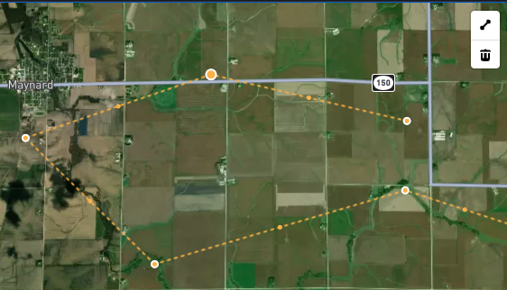

# Draw Trail

> Epic: [Trail Management](../spec.md) — E-001

## Flags

| Flag                |     |
| ------------------- | --- |
| DB Change           | ✅  |
| Style Only          | ⬜  |
| Env Update Required | ⬜  |

## Problem

Admins and builders currently have no way to create new trail geometries directly in the browser. Adding a trail requires manually inserting via PostGIS.

## Solution

Add a draw mode to the map page using Mapbox Draw (`@mapbox/mapbox-gl-draw`) and `mapbox-gl-draw-snap-mode`. When a builder or admin activates draw mode, they can:

1. Click to place waypoints along a trail route on the live Mapbox basemap.
2. Edit or delete waypoints before saving.
3. Confirm the geometry and provide trail metadata (name, difficulty, surface, description) in a side panel form.
4. Save — the trail `LineString` geometry and metadata are written to the `trails` table via the `upsert_trails` RPC.

### Starting New Trail

An **Add Trail** button (builders/admins only) opens Mapbox Draw in draw mode and opens the `TrailDetailDrawer` pre-populated with defaults. The new trail uses a sentinel `id = -1` until persisted.

### Editing Existing Trail

Activating edit on an existing trail loads its geometry into the Mapbox Draw layer. The `TrailDetailDrawer` is already open and switches to edit mode.

### Deleting Trail

A **Delete** button in the drawer (edit mode, builders/admins only) with a confirmation prompt. Performs a **soft delete** by setting `deleted_at` on the trail — does not hard-delete the row.

### Cancelling Edit

Cancel button in the drawer with a confirmation prompt. Reverts the Mapbox Draw layer to its pre-edit geometry state and resets the form.

### Navigation Guards

While geometry edits are in progress and unsaved:

- **React Router navigation** — `useBlocker` intercepts in-app route changes and prompts the user to confirm before discarding unsaved geometry.
- **Browser close / tab refresh** — a `beforeunload` listener shows the browser's built-in unload confirmation dialog.

### Editing Interactions

- Click on line → drag to adjust waypoints
- Enter or Right-click → finish drawing
- Shift+Click → add vertex to end of line
- Shift+Alt+Click → add vertex to start of line
- Space → toggle snap mode (snap-to-line / snap-to-point)
- Shift+Delete → remove last vertex
- Delete → remove selected vertex
- Ctrl+Z → undo last action
- Ctrl+Y → redo last undone action

### Permissions

Draw mode is available to **builders and admins only**. Members and public visitors see a read-only map.

## Sub-Tasks

| Issue | Description                                                                      | Backend Stub |
| ----- | -------------------------------------------------------------------------------- | :----------: |
| #53   | Edit existing trail with Draw tool + snap                                        |      ✅      |
| #54   | Create new trail (Add Trail button, `id = -1`, edit mode)                        |      ✅      |
| #55   | Delete trail (soft delete, confirmation prompt)                                  |      ✅      |
| #56   | Backend changes — geometry save on update, soft delete migration, insert via RPC |      —       |

## Out of Scope

- Elevation data capture during draw — handled by F-002.

## In Scope

- **Snap to line / point** — while drawing, snap the cursor to existing trail endpoints and lines to ensure clean network connectivity.

## Testing

**Unit tests:**

- `trailEditSchema` Valibot schema validates required fields (name, difficulty), rejects missing geometry.

**Integration tests:**

- Authenticated admin or builder can upsert a new trail via the RPC and it appears in `trails_view`.
- Member or unauthenticated user receives an RLS denial when attempting the same insert.
- Trail with duplicate name is rejected (unique constraint).
- Backend warns on invalid geometry (e.g. fewer than 2 coordinates) — save is allowed but a warning is surfaced to the user.
- Soft-deleted trail no longer appears in `trails_view`.
- Member/anon cannot soft-delete a trail (RLS denial).

**Edge cases:**

- Network error mid-save — form shows error state and does not clear entered data.
- Very long trail (500+ waypoints) — Mapbox Draw layer renders without lag.
- User navigates away mid-draw — prompt to confirm discard.
- Snap target is ambiguous (multiple nearby endpoints) — snap to the nearest.
- 3D editing support — pinning to terrain.

## Notes

- Builds on existing `TrailDetailDrawer` component and `trailEditSchema.ts`.
- Reuse shadcn form primitives (`input.tsx`, `select.tsx`, `textarea.tsx`) for the metadata form.
- Use `madrone-bark` button variant for the primary save action (project convention).
- Geometry warnings (short trail, potential self-intersection) are surfaced in the UI but do not block save — backend stores as-is.
- Draw accuracy depends on basemap zoom; no GPS snap in v1. Document this limitation in the UI.
- See issue #30 for prior discussion.

## Related Issues

| Issue | Description                               | Status |
| ----- | ----------------------------------------- | ------ |
| #30   | [F-001] Draw Trail (parent)               | Open   |
| #53   | Edit existing trail with Draw tool + snap | Open   |
| #54   | Create new trail                          | Open   |
| #55   | Delete trail (soft delete)                | Open   |
| #56   | Backend changes                           | Open   |

## Related PRs

| PR  | Description | Status |
| --- | ----------- | ------ |

## Changelog

| Date       | Description                                                                                  | Author   | Driver    | Why                                                          | Status      |
| ---------- | -------------------------------------------------------------------------------------------- | -------- | --------- | ------------------------------------------------------------ | ----------- |
| 2026-03-24 | Spec created                                                                                 | KS       | blueprint | New spec system                                              | planned     |
| 2026-03-26 | Sub-tasks defined; edit/create/delete/backend issues created (#53–56); spec updated to match | KS       | ta        | Tech assessment surfaced backend gaps and sub-task breakdown | in-progress |
| 2026-03-27 | Added Navigation Guards section; `useBlocker` and `beforeunload` guard behaviour documented  | @copilot | impl      | Implemented as part of #53 edit-existing-trail work          | in-progress |
