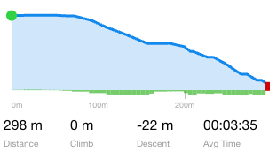

# Trail Elevation Profile

> Epic: [Trail Management](../spec.md) — E-001

## Flags

| Flag | |
|------|-|
| DB Change | ✅ |
| Style Only | ⬜ |
| Env Update Required | ⬜ |

## Problem

The trail map shows 2D geometry but gives visitors no sense of how hilly a trail is. Elevation gain/loss and a visual profile are standard expectations on trail apps and are critical for hikers and cyclists planning routes.

## Solution

When a user selects a trail, display an elevation profile chart in the `TrailDetailDrawer` (x = distance along trail, y = elevation in metres), plus gain/loss stat badges.

**Elevation data strategy — one-time fetch, persisted as 3D geometry:**

### Initial Solution
Elevation is fetched once from the Mapbox Terrain raster source and written back to the database as a `LineStringZ` geometry. It is never re-fetched at view time — the chart reads z-coordinates directly from the stored geometry. 10m resolution to start.

**Fetch process:**

1. Resample the 2D trail LineString to a uniform spacing (e.g. every 10 m) using a turf.js helper, producing an evenly-spaced point array along the line.`
2. For each resampled point, query the Mapbox Terrain-RGB raster tile to get the elevation value in metres.
3. Reconstruct the LineString with z-coordinates from the sampled elevations.
4. Write the `LineStringZ` geometry back a `trails-geom` table via an admin RPC (`update_trail_geometry`).
5. Calculate distance, elevation gain/loss stats and save `trails-geom`.

**Trigger — two entry points:**

- **On new trail save or trail geom update (F-001)** — elevation sampling runs automatically after the 2D geometry is saved.
- **Sync all trails tool (admin/builder only)** — a manual trigger in the admin UI that re-samples and updates elevation for all trails in bulk. Useful for backfilling existing trails or after a Mapbox terrain data update.

**Chart library:** Minimal custom SVG component. No charting library added to the bundle.

## Out of Scope

- Real-time elevation fetch on trail selection — elevation is pre-baked into the geometry.
- Survey-grade accuracy — Mapbox Terrain tiles are ~10 m resolution which is sufficient.

## Testing

**Unit tests:**
- `resampleLineString(coords, spacingMetres)` — returns evenly-spaced points at correct intervals for a known geometry.
- `parseElevationProfile(linestringZ)` — returns `{ distance: number[], elevation: number[] }` from a 3D coordinate array.
- Distance accumulation is correct for a known 3-point geometry.
- Handles empty coordinate array gracefully (returns empty arrays, no throw).

**Integration tests:**
- After saving a new trail, the stored geometry includes z-coordinates.
- Admin or builder can trigger bulk elevation sync — all trails in `trails_view` have z-coordinates after sync completes.
- Member or unauthenticated user cannot call `update_trail_geometry` RPC (RLS denial).

**Edge cases:**
- Trail with only 2 waypoints — resampling produces intermediate points; profile renders correctly.
- Flat trail (all z identical) — renders a flat line, no division-by-zero.
- Missing Mapbox token — sync tool is disabled; chart shows "elevation data unavailable" if z-coords are absent.
- Bulk sync interrupted mid-run — re-running sync is idempotent; partial updates are acceptable.

## Notes

- Resample spacing defaults to 10 m; make it configurable per-run if needed.
- Use `@turf/line-chunk` or `@turf/along` for resampling.
- Mapbox Terrain-RGB elevation formula: `height = -10000 + ((R * 256 * 256 + G * 256 + B) * 0.1)`
- DB migration required: alter `geometry` column to `GEOMETRY(LineStringZ, 4326)`. Existing 2D rows stay valid — PostGIS accepts mixed 2D/3D in the same column.
- Elevation gain/loss totals (e.g. "+340 m / -120 m") shown as stat badges above the chart.
- Chart area fill: `--color-forest-shadow` (project color palette).
- Chart component lives in `src/components/TrailDetailDrawer/`.
- Related to issue #29 ("Task: Trail Elevation Profile").

## Related Issues

| Issue | Description | Status |
|-------|-------------|--------|

## Related PRs

| PR | Description | Status |
|----|-------------|--------|

## Changelog

| Date | Description | Initiated by | Why |
|------|-------------|--------------|-----|
| 2026-03-24 | Spec created | KS | New spec system |

## Related PRs

| PR | Description | Status |
|----|-------------|--------|
